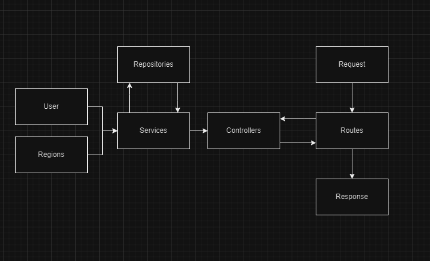
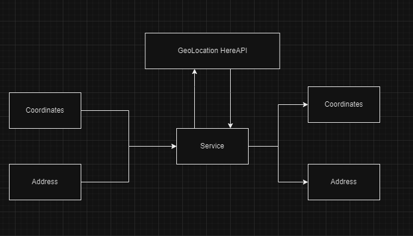

# Documentação da API OZmap

## Sumário
- [Visão Geral](#geral_vision)
- [Configurando o ambiente](#config)
- [Arquitetura da API](#architeture)
- [Funcionalidades da API](#functions)
<a id="geral_vision"></a>
## 1️⃣ Apresentação do Projeto

A geolocalização desempenha um papel fundamental no mundo, permitindo análises precisas e tomadas de decisão baseadas em dados reais. A API contribui para essa missão ao fornecer funcionalidades de CRUD para usuários e regiões, além de integração com serviços de geolocalização externos.

### 1.2 Visão Geral da API

A API oferece funcionalidades para criar, listar, atualizar e excluir usuários e regiões. Ao utilizar a API, os usuários podem gerenciar facilmente seus dados geoespaciais, promovendo maior eficiência e tomada de decisões mais precisas.

Os principais diferenciais da API incluem sua integração com serviços de geolocalização externos, garantindo a precisão das coordenadas, e sua facilidade de uso, proporcionando uma experiência amigável para os desenvolvedores.

<a id="config"></a>
## 2️⃣ Configuração do Ambiente
### 2.1 Pré-requisitos
Para executar a API, você precisará ter o Docker instalado em sua máquina.

### 2.2 Instalação do Docker
Para instalar o Docker, siga as instruções específicas para o seu sistema operacional:

- **Windows**: [Docker Desktop for Windows](https://docs.docker.com/desktop/install/windows-install/)
- **Mac**: [Docker Desktop for Mac](https://docs.docker.com/desktop/install/mac-install/)
- **Linux**: [Docker Engine](https://docs.docker.com/engine/install/)

### 2.3 Configuração do Projeto
Após instalar o Docker, clone o repositório do projeto:

```bash git clone git@github.com:guicastro13/technical-assessment-int_dm.git cd technical-assessment-int_dm```

Você ira precisar de um arquivo .env para as variáveis de ambiente, crie um arquivo ***.env.docker*** na pasta raiz do projeto,
```touch .env.docker```
E adicione no seu conteúdo a url do banco mongodb e também a chave da api HereAPI, para o serviço de GeoLocalização

``` GEO_HEREAPI_KEY='iKetBAF352CCNoMYmLlrygt6jA-JJf3_RuuNtlJBlFA'  MONGO_URL='mongodb://localhost:27017/techinical_test' ```

NOTA: Caso você deseje rodar o projeto localmente, você ira precisar ter o mongo intalado em sua maquina, e criar um arquivo ***.env.dev***, com as mesmas informações.

###  2.4 Inicialização com Docker Compose

Após realizar o clone do projeto, você precisa inicializar a API atravez do comando

```bash docker-compose up --build```

Para rodar a versão de testes

````bash docker-compose run test-service```

<a id="architeture"></a>
## 3️⃣ Arquitetura da API
- **Padrão RESTful**:
A API segue os princípios do padrão RESTful. Isso significa que os desenvolvedores podem interagir com a API de forma intuitiva e previsível, utilizando métodos HTTP (GET, POST, PUT, DELETE) para realizar operações CRUD (Criar, Ler, Atualizar, Deletar) nos recursos da API.
- **Injeção de Dependência e Inversão de Dependência**:
A API utiliza injeção de dependência para gerenciar as dependências entre seus componentes, promovendo flexibilidade, modularidade e testabilidade do código. A inversão de dependência, por sua vez, desacopla os componentes da API, facilitando testes e manutenções.

- **Entidades**:
    `Entidades`: Representam os principais objetos de negócio da API, como Usuario e Regiao e regras de negocio mais baixo nível.
    `Services`: Encapsulam a lógica de negócio relacionada às entidades, abstraindo a implementação dos detalhes técnicos.
    `Repositories`: Fornecem uma interface abstrata para acessar e persistir dados das entidades, separando a lógica de negócio da implementação do banco de dados.



- **Serviço externo**
    Na nossa API, utilizamos um serviço externo para resolvermos endereços <-> coordenadas, utilizando a api do HereAPI, é uma api amigável, facil de implementar e bem confiável em seus resultados



### 3.1 Diagrama de Classes

O diagrama de classes abaixo representa as entidades principais da API, seus atributos, métodos e relacionamentos.

<a id="functions"></a>
## 4️⃣ Funcionalidades da API

### 4.1 CRUD de Usuários

- **Criar Usuário**:
  - Endpoint: `POST /user/create`
  - Descrição: Cria um novo usuário.
  - Corpo da Requisição: `{ name, email, address?, coordinates? }`

- **Listar Todos os Usuários**:
  - Endpoint: `GET /user/get-all`
  - Descrição: Retorna todos os usuários cadastrados.

- **Obter um Usuário pelo ID**:
  - Endpoint: `GET /user/get-one/:user_id`
  - Descrição: Retorna as informações de um usuário específico.

- **Atualizar Usuário**:
  - Endpoint: `PUT /user/update/:user_id`
  - Descrição: Atualiza as informações de um usuário existente.
  - Corpo da Requisição: `{ name?, email?, address?, coordinates? }`

- **Excluir Usuário**:
  - Endpoint: `DELETE /user/delete/:user_id`
  - Descrição: Exclui um usuário existente.

### 4.2 CRUD de Regiões

- **Criar Região**:
  - Endpoint: `POST /region/create`
  - Descrição: Cria uma nova região.
  - Corpo da Requisição: `{ name, coordinates, userId }`

- **Listar Todas as Regiões**:
  - Endpoint: `GET /region/get-all`
  - Descrição: Retorna todas as regiões cadastradas.

- **Obter uma Região pelo ID**:
  - Endpoint: `GET /region/get-one/:region_id`
  - Descrição: Retorna as informações de uma região específica.

- **Atualizar Região**:
  - Endpoint: `PUT /region/update/:region_id`
  - Descrição: Atualiza as informações de uma região existente.
  - Corpo da Requisição: `{ name?, coordinates?, userId? }`

- **Excluir Região**:
  - Endpoint: `DELETE /region/delete/:region_id`
  - Descrição: Exclui uma região existente.

### 4.3 Obter Regiões Próximas a uma Coordenada

- **Endpoint**: `GET /regions?coordinates=latitute,longitude&userId=userId&howMuchCloseInKM=20`
- **Descrição**: Retorna as regiões próximas a uma coordenada específica.
- **Parâmetros da Requisição**:
  - `coordinates` (number): Coordenadas geográficas no formato "latitude,longitude".
  - `userId` (opcional, string): ID do usuário para filtrar as regiões. Se fornecido, apenas as regiões de outros usuários serão retornadas.
  - `howMuchCloseInKM` (opcional, number): Distância máxima em quilômetros para considerar as regiões próximas. Se não fornecido, o valor padrão é 10 km.
- **Resposta de Sucesso**:
  - `statusCode`: 200
  - `body`: Array de objetos representando as regiões próximas encontradas.
- **Resposta de Erro**:
  - `statusCode`: Código de erro correspondente.
  - `body`: Mensagem de erro detalhando o motivo da falha.
- **Observações**:
  - Se nenhum valor for fornecido para `howMuchCloseInKM`, o valor padrão de 10 km será aplicado automaticamente.
  - Se nenhum `userId` for fornecido, serão retornadas todas as regiões próximas à coordenada especificada, independentemente do usuário proprietário.
  - Se um `userId` for fornecido, apenas as regiões de outros usuários serão retornadas.
- **Exemplo de Chamada de API**:
```http GET /regions?coordinates=-23.5505,-46.6333&userId=userIdUUID&howMuchCloseInKM=20```

### 4.4 Gerar Relatório dos Logs da API
- **Endpoint**: `GET /relatorio/generate?startDate=YYYY-MM-DD&endDate=YYYY-MM-DD`
- **Descrição**: Gera um relatório em formato CSV contendo informações dos logs da API.
- **Parâmetros da Requisição**:
    - `startDate` (string): Data de início para filtrar os logs (formato: "YYYY-MM-DD"). Se fornecido, apenas os logs a partir desta data serão incluídos no relatório.
     - `endDate` (opcional, string): Data de término para filtrar os logs (formato: "YYYY-MM-DD"). Se fornecido, apenas os logs até esta data serão incluídos no relatório. Se não fornecido, serão incluídos todos os logs a partir da data de início.
- **Resposta de Sucesso**:
    - `statusCode`: 200
    - `body`: Mensagem indicando que o relatório foi gerado com sucesso e seu caminho de arquivo.
- **Resposta de Erro**:
    - `statusCode`: Código de erro correspondente.
    - `body`: Mensagem de erro detalhando o motivo da falha.
- **Observações**:
    - Se endDate não for fornecido, o relatório incluirá apenas os logs do dia.
    - Se ambos startDate e endDate forem fornecidos, o relatório incluirá apenas os logs dentro do intervalo de datas especificado.
- **Exemplo de Chamada de API**:
```http GET /relatorio/generate?startDate=2024-04-17&endDate=2024-04-20```